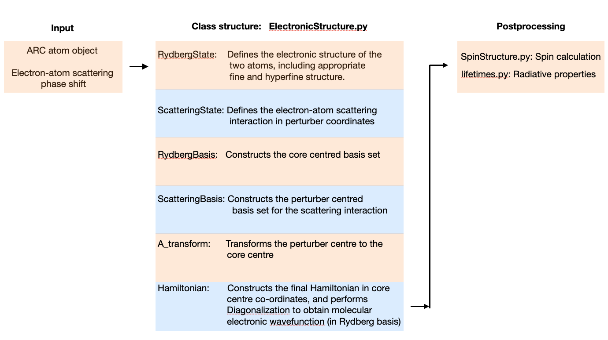

# Alkali-ULRM

Alkali-ULRM is a Python package designed to calculate the electronic structure of **Ultralong-Range Rydberg Molecules (ULRMs)**. These exotic molecules are composed of an alkali Rydberg atom bound to a ground-state atom via quantum scattering. The package provides a modular, object-oriented framework for modeling the electronic structure, spin couplings, and radiative properties of these molecules using Hamiltonian modeling.

---

## Features

- **Electronic Structure Calculations**: Compute the electronic structure of ULRMs using quantum scattering models.
- **Spin Coupling Analysis**: Analyze spin interactions and couplings within the molecule.
- **Radiative Properties**: Evaluate radiative lifetimes and other related properties.
- **Object-Oriented Design**: Modular and extensible Python code for easy integration and customization.
- **ARC Dependency**: Utilizes the [ARC (Alkali.ne Rydberg Calculator)](https://github.com/nikolasibalic/ARC-Alkali-Rydberg-Calculator) package for atomic data and attributes.

---

## Installation

To use Alkali-ULRM, clone the repository and install the required dependencies:

```bash
git clone https://github.com/rohansrikumar/Alkali-ULRM.git
cd Alkali-ULRM
pip install -r requirements.txt
```

Ensure that the ARC package is installed, as it is a dependency for this software.


## Class Structure and Data Flow

The package is designed with a modular class structure to ensure flexibility and extensibility.
Key modules include (see src folder):

`ElectronicState.py`: Handles the electronic structure calculations.

`SpinOperators.py`: Manages angular momentum and spin coupling calculations.

`Lifetimes.py`: Computes radiative properties and lifetimes of the Rydberg atom and molecule.

See the flowchart below to understand the basic data flow and utility:



## Mathematical Model

The mathematical modeling of the molecule and the associated Hamiltonian is based on the work of Matt Eiles et al.. The Hamiltonian incorporates quantum scattering theory to describe the interaction between the Rydberg electron and the ground-state atom.

For more details, refer to the original publication:

Eiles, M. T., et al. [Hamiltonian for the inclusion of spin effects in long-range Rydberg molecules](https://doi.org/10.1103/PhysRevA.95.042515).


## References

[ARC (Alkali.ne Rydberg Calculator)](https://github.com/nikolasibalic/ARC-Alkali-Rydberg-Calculator)

Eiles, M. T., et al. [Hamiltonian for the inclusion of spin effects in long-range Rydberg molecules](https://doi.org/10.1103/PhysRevA.95.042515)
